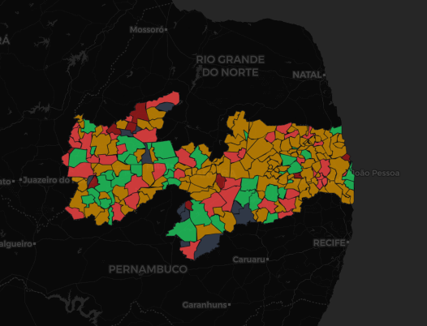
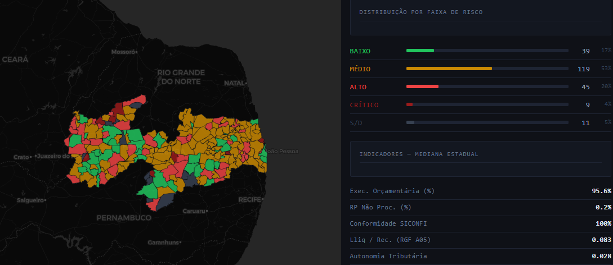
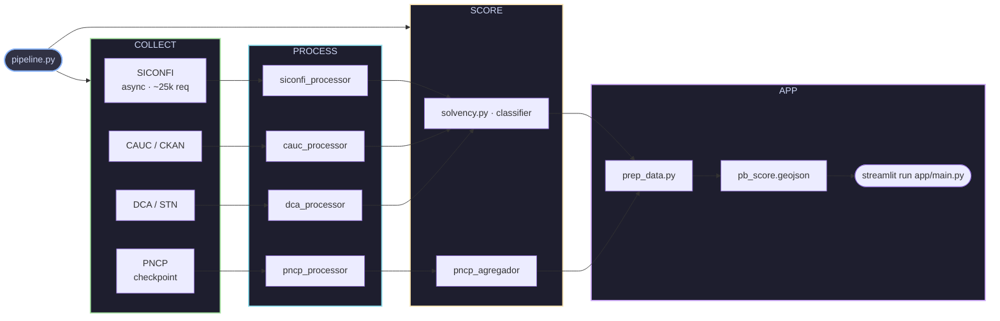

# SolveLicita

[](https://www.python.org/)
[](https://solvelicita.streamlit.app)
[](tests/)
[](docs/METODOLOGIA.md)
[](LICENSE)



---

## A pergunta

Municípios brasileiros contratam bilhões em fornecimentos por ano. Mas qual prefeitura tem capacidade real de pagar o que contrata?

Essa pergunta não tem resposta pública, padronizada e acessível. Os dados existem, estão nos sistemas do Tesouro Nacional, mas dispersos em relatórios técnicos que exigem conhecimento contábil para interpretar. SolveLicita os cruza e os transforma em um único número por município.

---

## O score

Um **Score de Solvência (0–100)** calculado a partir de seis indicadores fiscais públicos, ponderados por relevância:

| Indicador | Fonte | Peso | O que mede |
|---|---|---|---|
| Liquidez Líquida | SICONFI / RGF Anexo 05 | 30% | Caixa disponível após Restos a Pagar |
| Bloqueio Federal | CAUC / STN | 20% | Pendências que bloqueiam repasses federais |
| Execução Orçamentária | SICONFI / RREO Anexo 01 | 20% | Aderência entre receita prevista e realizada |
| Transparência Fiscal | SICONFI | 15% | Continuidade de entrega de dados públicos |
| Autonomia Tributária | FINBRA / DCA | 10% | Dependência do FPM vs receita própria |
| RP Crônicos | SICONFI / RREO Anexo 07 | 5% | Histórico de dívidas com fornecedores |

A fórmula, os limiares e as justificativas de cada escolha estão em [`docs/METODOLOGIA.md`](docs/METODOLOGIA.md).

**Classificação:**

| Score | Classificação |
|---|---|
| ≥ 75 | 🟢 Risco Baixo |
| 55 – 74 | 🟡 Risco Médio |
| 35 – 54 | 🔴 Risco Alto |
| < 35 | ⛔ Crítico |
| — | ⚫ Sem Dados |

Além do score numérico, dois caps de classificação operam de forma independente: municípios com histórico de não entrega de dados não podem ser classificados como Risco Baixo, e municípios com padrão crônico de Restos a Pagar Processados têm teto em Risco Médio.

---

## Resultados — Paraíba

**223 municípios** · dados 2020–2025 · atualizado em março/2026



| Classificação | Municípios | % |
|---|---|---|
| 🟢 Risco Baixo | 39 | 17% |
| 🟡 Risco Médio | 119 | 53% |
| 🔴 Risco Alto | 45 | 20% |
| ⛔ Crítico | 9 | 4% |
| ⚫ Sem Dados | 11 | 5% |

**Medianas estaduais:** Execução orçamentária 95,6% · Lliq/Receita 0,083 · Autonomia tributária 0,028

O dashboard interativo, com ficha individual por município, está disponível em **[solvelicita.streamlit.app](https://solvelicita.streamlit.app)**.

---

## Arquitetura do pipeline

Coleta, processamento, cálculo do score e geração do mapa são etapas separadas, cada uma executável de forma isolada. O `pipeline.py` as orquestra.



---

## Como reproduzir

```bash
git clone https://github.com/Fel-tby/solvelicita.git
cd solvelicita
python -m venv venv
venv\Scripts\activate        # Windows
# source venv/bin/activate   # Linux/macOS
pip install -r requirements.txt

python pipeline.py           # interativo: escolha modo e etapas
streamlit run app/main.py    # abre o dashboard
```

```bash
pytest       # roda os testes automatizados
pytest -v    # verbose
```

---

## Status

- [x] Paraíba — 223 municípios, 2020–2025
- [ ] Relatório narrativo público
- [ ] Expansão para demais estados

---

## Como citar

> SolveLicita. *Score de Solvência Municipal — Paraíba*. 2026. Disponível em: https://solvelicita.streamlit.app. Código e metodologia: https://github.com/Fel-tby/solvelicita.

---
